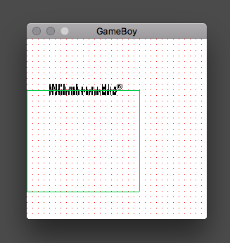
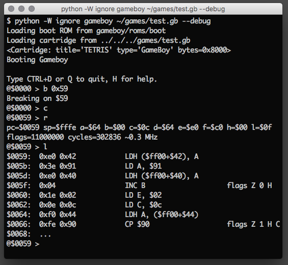
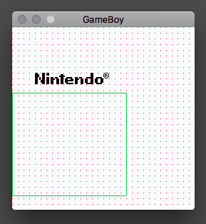
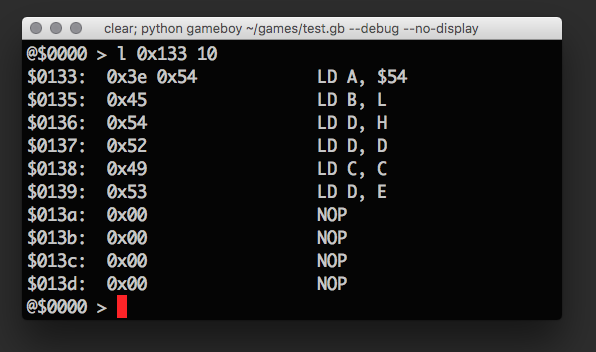

Gameboy Emulator Progress Log
=============================

Writing a Gameboy emulator is supposed to be pretty straight-forward, so I
thought I'd give it a go.

I've decided not to cheat by looking at any other implementation. That way,
when it finally works, it will feel like a much more personal victory.

Day 1
-----

Started off by writing some skeletal Python code for a CPU, display and memory
mapping.

Found a boot ROM online. It comes with a disassembly listing. That way I can
write my own disassembler and check that it works.

Glad I started on the disassembler. Very easy to get the opcode tables wrong.

Got to spend almost six hours on this today. Not much progress, but I like to
go slowly, but steadily. I'll need to finish the disassembler, then add the
rest of the opcodes. When that's done, I should be able to copy the disassembly
code for use in the CPU instruction dispatcher.

Day 2
-----

Added the remaining opcodes needed to disassemble the boot ROM. Made into a
package, added command line options and added a memory controller to perform
memory mapping. Not very elegantly structured code, but that's not important at
this point.

Will now start with an instruction dispatcher that will eventually be able to
run the boot code.

Started on the instruction fetcher, decoder and executor. Added a very simple
step-debugging interface. Will now need to actually implement those opcodes.
This part will consist of reading and understanding the memory layout, the bank
switching, how to update flags and so on. The execution of instructions is
currently badly structured, so I'll have to do a lot by hand. When I understand
it properly, I can abstract this further, reducing code.

Day 3
-----

Continued implementing instructions. I'm very happy with how I separated the
fetch, decode and execute stages.

Restructured the code. Seem to have fixed the memory mapping. At least it's
good enough for now.

Made a very simple debugger and used it to debug CPU instructions.  A few hours
in, I suddenly realized how essential the debugger had come to be.

Jumps and call with return work, meaning loops work. Seems to execute the boot
code correctly, although debugging far out in the code has become overwhelming.

The emulator currently runs at 0.6 MHz, which isn't too bad for unoptimized
Python. *If* that ever becomes an annoyance, I'll whip out C and Cython to nuke
the problem from space.

At the end of the day, there's an invalid memory access that stops progress,
preventing the boot code to finish.

Next up: Get the boot code to run to end. After that, it's time to hook up a 2D
display. My gut feeling is that will uncover new bugs.

Day 4
-----

Had I just spent five more minutes the last time, I'd see that the problem was
a jump that was not interpreted relatively. Fixing that, the program seemed to
run forever. Breaking in the debugger, I saw what was happening: The boot code
was waiting for the next screen frame! That means it's time to implement the
hardware I/O registers.

Started implementing the video display driver. Currently, it just draws
rubbish, but at least something is happening!

Day 5
-----

Did the video thing incorrectly. Started on a (more) correct one. Figured out more
about how to stich background tiles, and was able to render a recognizable,
albeit broken, Nintendo logo:

The window shows the entire 256x256 pixel display area, while the green box
displays what will be visible on the actual LCD screen. The red pixels show the
upper left corner of each tile. I'm not sure what's wrong with this, but since
the circled "registered" mark is correct, I suspect some incorrectly
implemented opcodes.

The cool thing is that the green box moves upward, clearly showing how the logo
will scroll down on the LCD screen.

Here's also a view of the debugger. Here I break when the program counter is at
0x0059, which is where the scrolling loop is set up.

Having a good debugger is essential to this task. Didn't spend much time on the
emulator today.

Day 6
-----

The logo is now rendered correctly!

My hunch was right: I was doing flags and the RLA and RL C instructions
incorrectly. Fixing up those produces this fine, scrolling logo:

The problem at this moment is that the whole thing runs very slowly, the screen
rendering being the slowest. I need to do some minimum performance
optimizations, because the scrolling takes ages before completing.

Day 7
-----

I have not been able to spend many hours the last few days. Here are the
intermittent updates:

  * I have done a small optimization to the drawing routine. I now get around 3
    frames per second on vanilla Python. PyPy works as well, but gets 0.5 fps
    on one machine and 6 fps on another.

    I have to say that writing to a 2D buffer in SDL is extremely slow, even in
    software rendering. Which is just insane, and probably means that I'm doing
    it wrong. I'm quite tempted to implement my own in C and bind it with
    Cython. Of course, then I'll do the CPU and memory there as well. The only
    thing I don't want to deal with myself is sound processing. The other stuff
    is easy.

  * I've finished typing out the basic (non-extended) instruction set. It's a
    lot of work, and I now regret that I didn't just download a JSON file or
    something like that.

    With the sheer amount of opcodes I now have, I have to
    restructure how they are executed. Now they're just one big if-else-block.
    I'll just create a list of 256 functions and index with the opcode so I can
    dispatch. Those functions will have the same signature.

    I played with the idea of 1:1 compiling the instructions to such subroutine
    calls, just like Forth threaded code, but of course you'd then need a
    separate copy of the raw data, and it would only be possible for ROM-data
    since RAM instructions can be self-modifying, and also some devious game
    developer might decide to jump right into the middle of a multi-byte
    instruction. So I've decided against it. I know it's a deceiving thought,
    and that doing so in reality is very tricky.

  * After implementing the entire instruction set, I'll start trying to run a
    real game. There will be a lot more work to do: I need to make sure every
    instruction is right, I need to handle interrupts, I need to add all
    special memory locations (like I/O, etc.), I need to add a sound driver and
    handle input.

    All of that is doable, but a lot of work. With the initial speed, I am now
    slightly overwhelmed. But given that the boot code works fine, it is quite
    exciting as well --- if it wasn't for that damn framerate. I want my 60
    fps! I'm very tempted to fix the framerate right now, then add sound, so
    that the boot code will be complete. We'll see.

Today's screenshot:

Above is a debugger listing for a game. Can you guess which one? It is entirely
possible to find out by studying the debug output, and shouldn't be too hard
once you get it.

Day 8
-----

Another day where I can only spend a really small amount of time on the
project. Running errors now break into the debugger, and I implemented bank
switching. Concentrating on finishing up the rest of the instructions.
